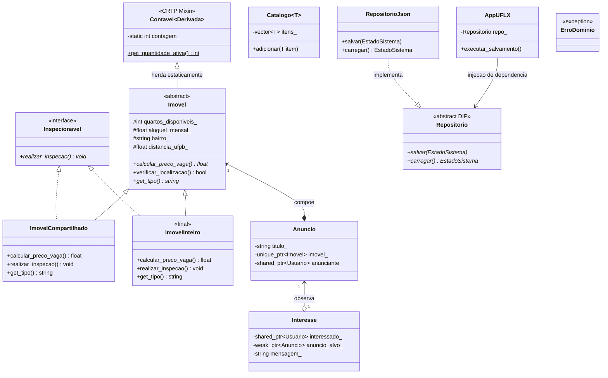
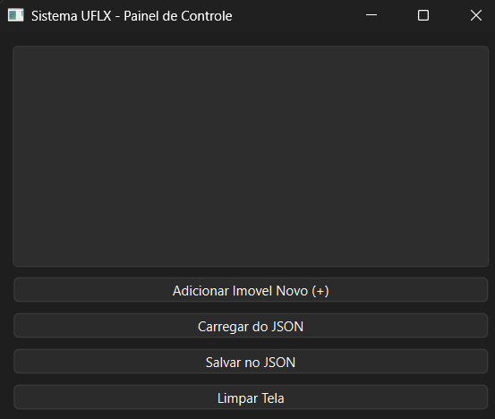
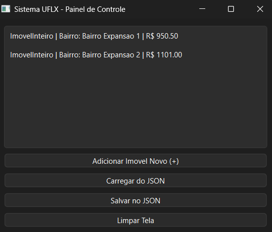
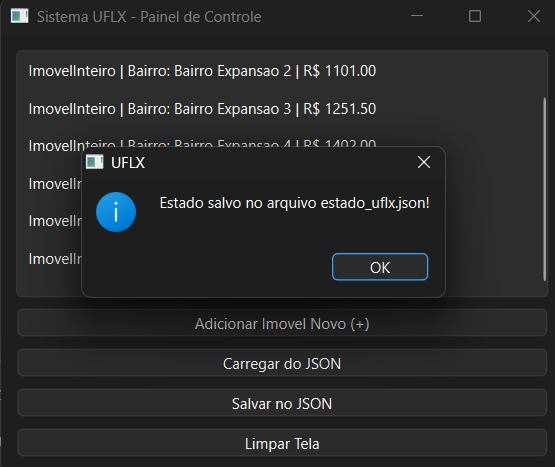
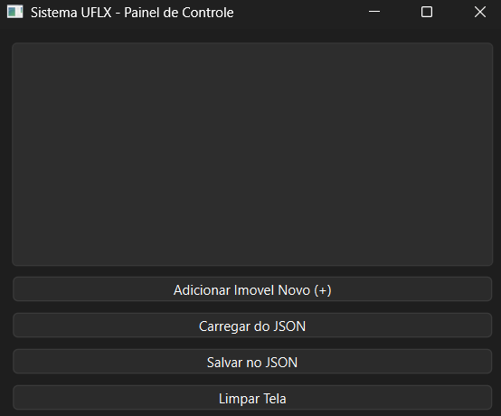
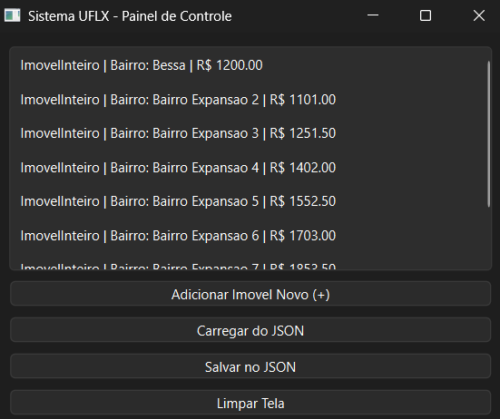

# Sistema UFLX
Projeto da disciplina Programação Orientada a Objetos que busco criar um sistema de comércio de imóveis voltado aos estudantes da UFPB.

Percebo que a forma de contato que os estudantes de superior têm para procurar/encontrar/oferecer vagas em imóveis (ou imóveis por completo) se limitam somente a grupos de conversa em aplicativos de rede social. Por conta disso, planejo criar esse sistema para melhorar essa situação e ajudar estudantes a encontrar/oferecer imóveis para moradia.

## Descrição do Domínio
O UFLX é um sistema de comércio de imóveis voltado para estudantes universitários. A plataforma permite que proprietários anunciem vagas ou imóveis completos e que estudantes demonstrem interesse nessas ofertas, facilitando o contato direto entre as partes.

## Conceitos Utilizados
### Ciclo de Vida e Smart Pointers
O sistema foi desenhado com gestão automática de memória, utilizando *smart pointers* de acordo com as seguintes regras de ciclo de vida:

- **Composição (`std::unique_ptr`):** Utilizada na relação entre `Anuncio` e `Imovel`. O imóvel pertence exclusivamente ao anúncio e deixa de existir na memória do sistema caso o anúncio seja removido.
- **Agregação (`std::shared_ptr`):** Utilizada na relação de `Usuario` com `Anuncio` e `Interesse`. Os locadores e estudantes são entidades independentes que continuam a existir na base de dados mesmo que os seus anúncios ou interesses sejam finalizados.
- **Observação (`std::weak_ptr`):** Utilizado na classe `Interesse` para observar o `Anuncio` alvo. Isto evita *memory leaks* e permite que o sistema verifique com segurança se o anúncio ainda está ativo antes de tentar processar um interesse.

### Herança Avançada
Foi inserida a interface puramente estrita Inspecionavel. Ela é utilizada para modelar a capacidade de inspecionar a residência. Esta interface foi adicionada às classes derivadas usando o princípio de herança múltipla.

Além disso, a classe derivada ImovelInteiro foi assinalada com a palavra-chave final, garantindo assim, que nenhum desenvolvedor futuro possa alterar o seu funcionamento.

### Programação Genérica
- **Template Reutilizável:** Foi criada a classe genérica `Catalogo<T>` para gerenciar coleções de diferentes tipos de entidades do sistema (como `Usuario` ou `Anuncio`), abstraindo a lógica de armazenamento e facilitando futuras expansões.
- **CRTP:** O padrão Curiously Recurring Template Pattern foi aplicado na classe estática `Contavel` herdada por `Imovel` para rastrear a quantidade de instâncias no sistema. A decisão pelo CRTP em vez de herança virtual clássica ocorre pois esta funcionalidade resolve a injeção estática em tempo de compilação, o que poupa o custo em tempo de execução de chamadas polimórficas de *vtables*.
- **Ranges e Adaptadores:** O uso do pipeline `<ranges>` em `main.cpp` dispensou a necessidade de um laço `for` com condicionais internas (`if`) para extrair os bairros de imóveis mais baratos. O uso encadeado de `views::filter` e `views::transform` tornou o código semântico, mais declarativo e operando sob *lazy evaluation* (avaliação preguiçosa), processando elementos apenas sob demanda comparado ao preenchimento estrito de coleções temporárias tradicionais.

### STL e Concorrência
- **Contêineres STL:** 
  - `std::map`: Escolhido para manter um índice de usuários pela chave (número de telefone), mantendo-os naturalmente ordenados para eventuais listagens.
  - `std::unordered_set`: Escolhido para catalogar os bairros disponíveis na plataforma. A estrutura *hash* garante a unicidade (sem bairros duplicados) e acesso em tempo constante `O(1)`.
- **Operação Paralelizável:** A rotina de inspeção da localização de um imóvel (`verificar_localizacao`) foi paralelizada através de `std::async`. Ela é genuinamente independente pois as propriedades e validações de um imóvel não dependem, não interferem e não acessam o estado de outros imóveis durante sua execução.
- **Segurança de Thread Sanitizer:** A variável agregadora `inspecoes_aprovadas` foi envolvida em um escopo de `std::lock_guard` e `std::mutex`. Ao rodar a flag de compilação `-fsanitize=thread`, assegura-se que a região crítica impede simultaneidade de escritas, evitando o apontamento de "*data race*".

### SOLID
- **SRP (Princípio da Responsabilidade Única):** Aplicado refatorando o salvamento. A classe `Imovel` não sabe salvar a si mesma no disco; essa responsabilidade foi separada e delegada inteiramente para a classe `RepositorioJson`.
- **OCP (Princípio Aberto/Fechado):** Ponto de extensão na interface `Repositorio`. É possível criar um novo `RepositorioBancoDeDados` e adicioná-lo ao sistema sem modificar nenhuma linha de código da classe principal `AppUFLX`.
- **LSP (Princípio da Substituição de Liskov):** A classe `AppUFLX` trabalha tanto com `RepositorioJson` quanto com `RepositorioMemoria`. O repositório de testes substituiu o oficial durante as avaliações sem que a classe mãe percebesse a troca e sem quebrar o sistema.
- **ISP (Princípio da Segregação de Interface):** Aplicado no TP2. A interface `Inspecionavel` isola o método `realizar_inspecao()`. Dessa forma, nenhum objeto que não possa ser inspecionado é obrigado a implementá-lo.
- **DIP (Princípio da Inversão de Dependência):** A classe de alto nível `AppUFLX` não instancia e nem depende diretamente de arquivos (`RepositorioJson`). Ela depende unicamente da abstração `Repositorio`, que é injetada em seu construtor.

## Diagrama UML



## Qt (Interface Gráfica)
O sistema possui uma camada visual baseada em `Qt6::Widgets`. A janela foi desenhada como uma "camada fina" (*thin layer*), atuando apenas como controladora visual (sem regras de negócio), delegando as chamadas para a abstração de alto nível do sistema (`AppUFLX`) de acordo com o princípio da Inversão de Dependência (DIP).

**Instruções de build:**
O projeto localiza a biblioteca pelo comando `find_package(Qt6 REQUIRED COMPONENTS Widgets)` no CMake.
Para compilar e executar o ambiente visual:
```bash
cmake -B build
cmake --build build
./build/gui ou `.\build\Debug\gui.exe`(Windows)
```

### Demonstração de Uso (GUI)
Abaixo, o fluxo de persistência de dados em disco orquestrado pela interface gráfica:

**1. Execução Inicial**
Ao iniciar o painel de controle, a interface apresenta uma lista vazia aguardando as chamadas ao motor de domínio.



**2. Adição Dinâmica**
Injeção de novos imóveis polimórficos na memória RAM (estado atual do sistema) via interface, formatando os valores em tempo real.



**3. Persistência (Salvamento no Disco)**
A interface delega à classe principal a serialização dos objetos dinâmicos em um arquivo `estado_uflx.json`.



**4. Limpeza da Interface**
A limpeza da tela apaga a representação visual (sem apagar os dados do disco), preparando o painel para testes de leitura limpa.



**5. Desserialização e Leitura**
O sistema lê o disco local, utiliza o método genérico não-intrusivo `from_json` para reconstruir os objetos de acordo com seus tipos e os projeta de volta na camada de apresentação.



---
#### 
*Artur Rodrigues Nunes de Almeida - 20250018637 - Aluno de Ciência de Dados e Inteligência Artificial - Centro de Informática (CI) / UFPB*